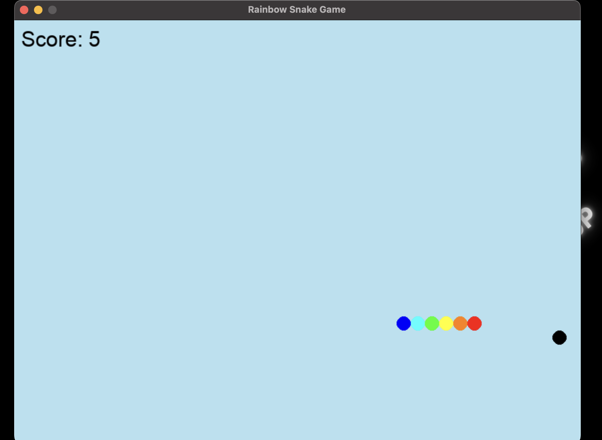

# 🐉🎮 Python Mini Games Collection

A collection of fun Python games made with **Pygame**.  
Currently includes:
- **Dragon Game** (Chrome Dino-style endless runner)
- **Bouncing Ball**
- **Rainbow Snake Game**

---

## 📸 Screenshots

### 🐉 Dragon Game
Endless runner where you jump over cacti and try to survive as long as possible.  


---

### 🏀 Bouncing Ball
A simple game with smooth ball movement and physics-like bouncing.  


---

### 🐍 Rainbow Snake Game
A colorful twist on the classic snake game, with a rainbow body and smooth controls.  


---

## 🛠 Prerequisites

Make sure you have the following installed:

- **Python 3.8+**  
- **Pygame** library  
  Install via:
  ```bash
  pip install pygame
